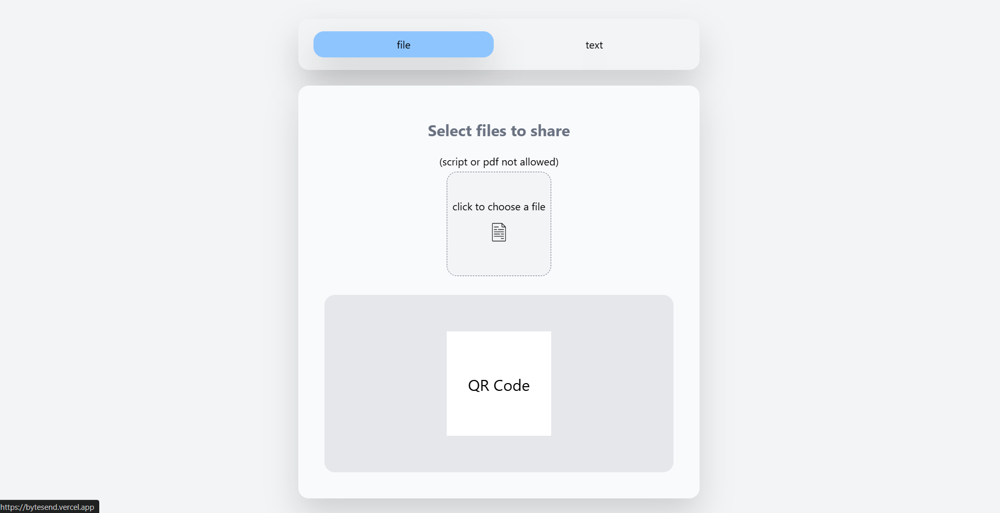
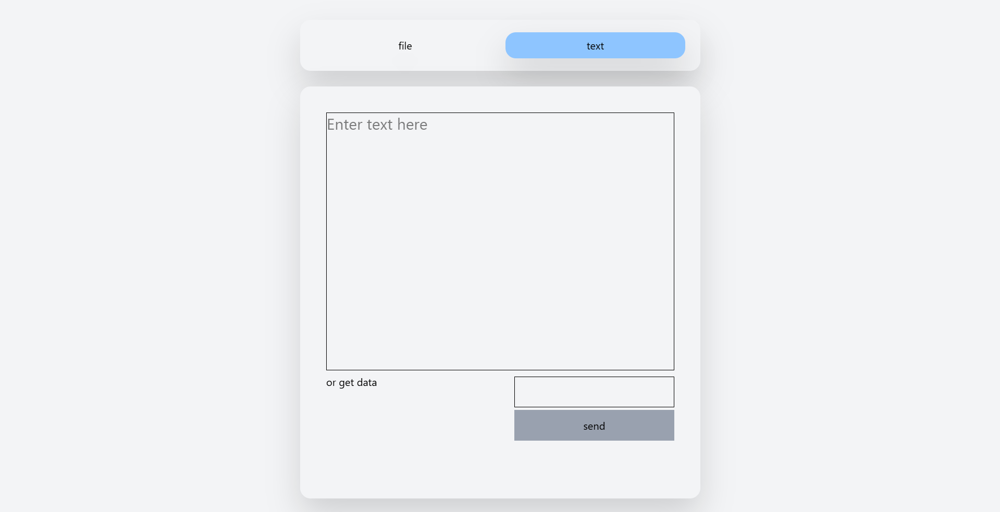

# 📤 ByteSend – Anonymous File & Text Sharing App

ByteSend is a lightweight Node.js + React app for quick, anonymous sharing of files and text — no sign-up, no logs, no history. Perfect for sending something fast and temporary without leaving a trace.

---

## 🚀 Features

### 📂 File Upload & Share
- Upload files up to 99 MB (app limit) — backend service limit is 128 MB due to Uguu
- Files expire automatically after 3 hours
- **Original filenames are removed** for privacy
- Generates an instant QR code for easy mobile download
- Blocks unsafe formats: `.pdf`, `.exe`, `.sh`, `.js`, `.bat`, `.ps1`, `.py`, `.php`, `.pl`, `.rb`
- Uses Uguu.se for temporary hosting (limitations apply: `.pdf` not supported)

---

### 📝 Text Send & Retrieve
- Send text snippets anonymously
- Receive a short retrieval code to share
- Auto-deletes after expiry — no database logs remain
- Perfect for **secure, short-term data sharing

💡 **Example Use Case:  
On a call with a teammate, you need to send them a temporary API key or database password without posting it in chat where it might be stored.  
Paste it into ByteSend, share the retrieval code, and it self-destructs after a few hours.

---

## 📸 Screenshots

### File Upload & Share


### Text Send & Retrieve



## 🛠 Tech Stack
- Backend: Node.js, Express
- Frontend: React (Vite) + Tailwind CSS
- File Upload: `express-fileupload`, `FormData`
- Networking: Axios
- Hosting: Uguu.se public file host
- Extras: QR Code API

---

## 📂 Project Structure

```text
Bytesend/
│
├── backend/                  # Node.js + Express backend
│   ├── index.js               # Main server entry
│   ├── routes/                # API route handlers
│   ├── utils/                  # Helper functions
│   ├── package.json
│
├── frontend/                 # React (Vite) frontend
│   ├── src/
│   │   ├── components/        # UI components
│   │   ├── pages/             # Page components
│   │   ├── App.jsx
│   │   ├── main.jsx
│   ├── package.json
│
├── README.md
└── LICENSE
```


## ⚠ Limitations
- Max file size: 99 MB (app enforced) / 128 MB (Uguu hard limit)
- Files expire in 3 hours
- Certain file types blocked for security
- `.pdf` uploads not supported due to Uguu restrictions

---

## 📜 License
MIT License — free to use, modify, and distribute.
