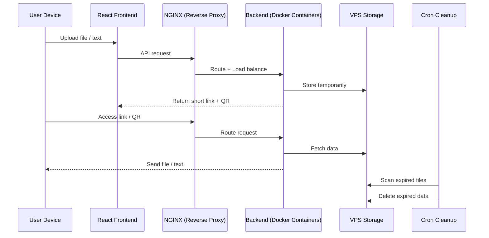
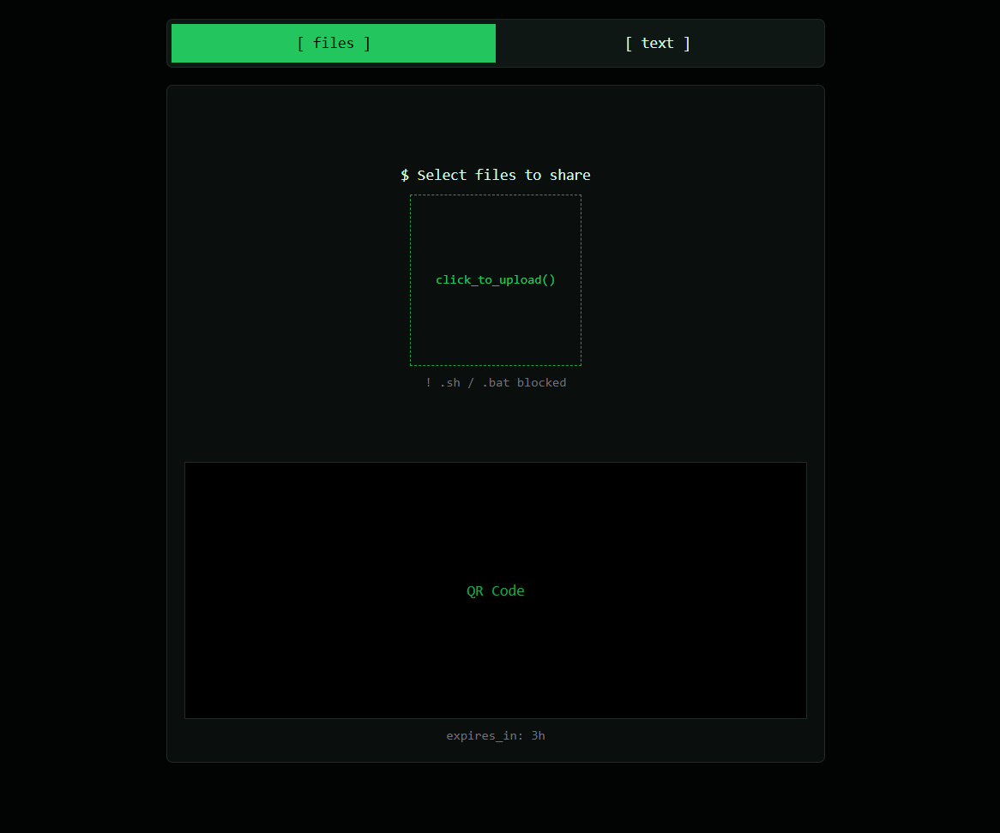
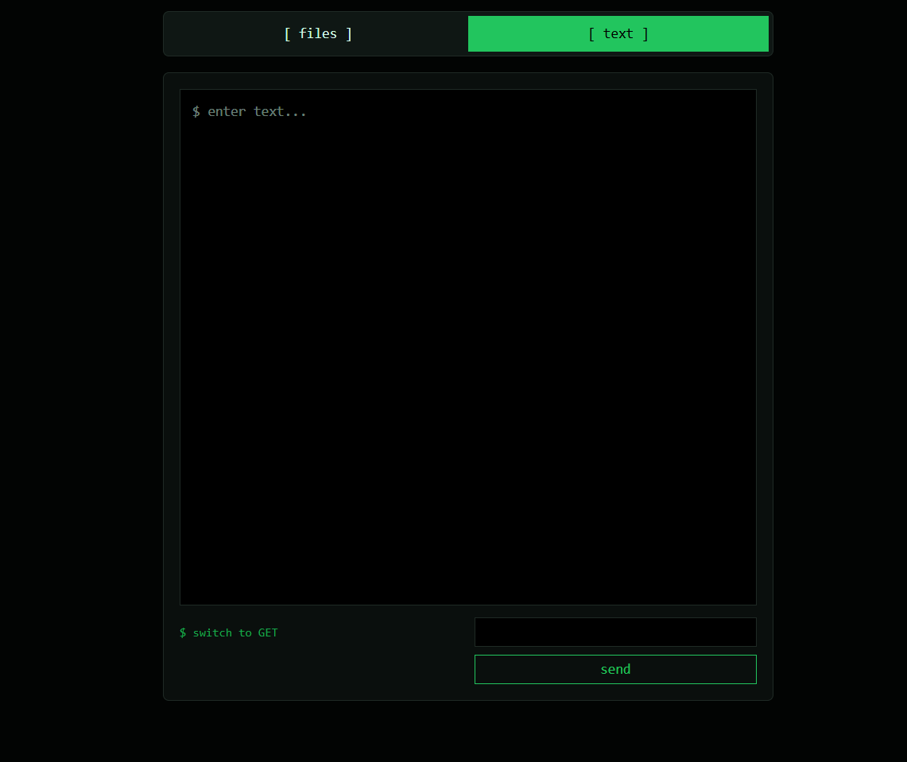

# 📤 ByteSend – Anonymous File & Text Sharing App

ByteSend is a lightweight Node.js + React app for quick, anonymous sharing of files and text — no sign-up, no logs, no history. It is designed as a stateless, ephemeral transfer layer for moving data across devices using short links and QR codes, without long-term storage.

---

## 🚀 Features

### 🧱 High-level design

* Stateless transfer flow: upload on one device, retrieve on another via short URL or QR, then let it expire.
* Ephemeral storage on a VPS-backed file service, with automatic expiry to keep data short-lived.
* Currently deployed on a VPS as a three-container stack (frontend, replicated backend, and NGINX reverse proxy) for horizontal scaling.
* Secured and automated with UFW firewall rules, cron-based cleanup of expired files, and CI/CD that rebuilds and redeploys containers on new pushes.

---

## 🔄 Flow Diagram


```mermaid
sequenceDiagram
    participant U as User Device
    participant FE as React Frontend
    participant NX as NGINX (Reverse Proxy)
    participant BE as Backend (Docker Containers)
    participant ST as VPS Storage
    participant CRON as Cron Cleanup

    %% Upload Flow
    U->>FE: Upload file / text
    FE->>NX: API request
    NX->>BE: Route + Load balance
    BE->>ST: Store temporarily
    BE-->>FE: Return short link + QR

    %% Download Flow
    U->>NX: Access link / QR
    NX->>BE: Route request
    BE->>ST: Fetch data
    BE-->>U: Send file / text

    %% Cleanup
    CRON->>ST: Scan expired files
    CRON->>ST: Delete expired data
```

---

### 📂 File Upload & Share

* Upload files up to 99 MB (app limit) — backend and storage tuned for small, bursty transfers
* Files are stored in temporary space on a VPS and expire automatically after a short time window (ephemeral by design)
* **Original filenames are removed** for privacy
* Generates an instant QR code for easy mobile download

---

### 📝 Text Send & Retrieve

* Send text snippets anonymously
* Receive a short retrieval code to share
* Auto-deletes after expiry — no database logs remain
* Perfect for **secure, short-term data sharing

💡 **Example Use Case**:
On a call with a teammate, you need to send them a temporary API key or database password without posting it in chat where it might be stored.
Paste it into ByteSend, share the retrieval code, and it self-destructs after a few hours.

---

## 📸 Screenshots

### File Upload & Share



### Text Send & Retrieve



## 🛠 Tech Stack

* Backend: Node.js, Express
* Frontend: React (Vite) + Tailwind CSS
* File Upload: `express-fileupload`, `FormData`
* Networking: Axios
* Storage: VPS-backed temporary file storage with auto-expiry
* Extras: QR Code API

---

## 📂 Project Structure

```text
filesharetextshare/
│
├── docker-compose.yml          # Frontend + backend stack definition
│
├── backend/                    # Node.js + Express backend
│   ├── Dockerfile
│   ├── index.js                # Server entry
│   ├── package.json
│   └── src/
│       ├── app.js              # Express app config
│       ├── controllers/
│       │   └── transferController.js
│       └── routes/
│           └── transferRoutes.js
│
├── frontend/                   # React (Vite) frontend
│   ├── Dockerfile
│   ├── index.html
│   ├── package.json
│   ├── vite.config.js
│   └── src/
│       ├── main.jsx
│       ├── Root.jsx
│       ├── index.css
│       └── components/
│           ├── Fpick.jsx
│           ├── Navbar.jsx
│           └── Nofile.jsx
│
└── README.md
```

## ⚠ Limitations

* Max file size: 99 MB (app enforced)
* Files are stored only temporarily on the VPS and cleaned up automatically after a short lifetime
* Certain file types blocked for security
