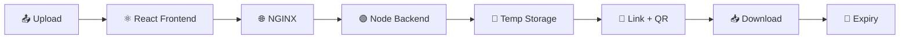
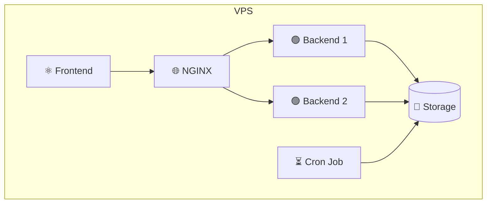
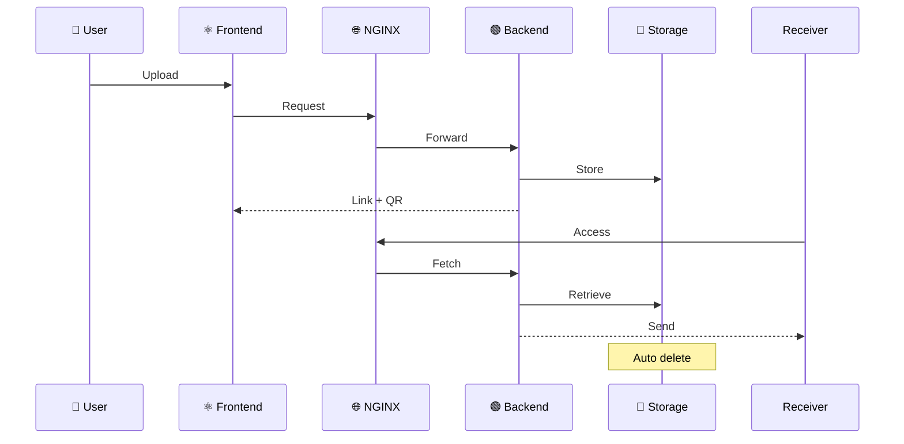

# 📤 ByteSend – Anonymous File & Text Sharing App

<p align="center">
  
</p>

<p align="center">
  
  
  
  
  
  
</p>

---

ByteSend is a lightweight **Node.js + React** app for quick, anonymous sharing of files and text — no sign-up, no logs, no history.

✨ Think of it as a **vanishing tunnel for data**:

```
Upload → Share → Disappear
```

---

## 🚀 Features

### 🧱 Core Design

* ⚡ Stateless architecture (no accounts, no DB)
* ⏳ Ephemeral storage with auto-expiry
* 🔗 Short URL + QR code sharing
* 🐳 Dockerized multi-container setup
* 🔁 Horizontally scalable backend
* 🔐 Secured via NGINX + UFW firewall
* 🧹 Cron-based cleanup system
* 🚀 CI/CD auto deployment

---

## 🧩 System Architecture


```mermaid
flowchart LR
    A[📤 Upload] --> B[⚛️ React Frontend]
    B --> C[🌐 NGINX]
    C --> D[🟢 Node Backend]
    D --> E[💾 Temp Storage]
    E --> F[🔗 Link + QR]
    F --> G[📥 Download]
    G --> H[🧹 Expiry]
```

---

## 🐳 Container Architecture


```mermaid
flowchart TB
    subgraph VPS
        NGINX[🌐 NGINX]
        FE[⚛️ Frontend]
        BE1[🟢 Backend 1]
        BE2[🟢 Backend 2]
        STORAGE[(💾 Storage)]
        CRON[⏳ Cron Job]
    end

    FE --> NGINX
    NGINX --> BE1
    NGINX --> BE2
    BE1 --> STORAGE
    BE2 --> STORAGE
    CRON --> STORAGE
```

---

## 🔄 Request Flow


```mermaid
sequenceDiagram
    participant U as 👤 User
    participant F as ⚛️ Frontend
    participant N as 🌐 NGINX
    participant B as 🟢 Backend
    participant S as 💾 Storage

    U->>F: Upload
    F->>N: Request
    N->>B: Forward
    B->>S: Store
    B-->>F: Link + QR
    Receiver->>N: Access
    N->>B: Fetch
    B->>S: Retrieve
    B-->>Receiver: Send
    Note over S: Auto delete
```

---

## 📂 Features

### 📁 File Sharing

* 📦 Upload up to **99 MB**
* 🕒 Temporary storage
* 🧼 Filename removed
* 📱 QR code access

### 📝 Text Sharing

* 🔐 Anonymous text transfer
* 🎟 Short retrieval code
* ⏳ Auto-delete

---

## 🛠 Tech Stack

| Layer         | Tech                       |
| ------------- | -------------------------- |
| ⚛️ Frontend   | React (Vite), Tailwind CSS |
| 🟢 Backend    | Node.js, Express           |
| 🔗 Networking | Axios                      |
| 📦 Upload     | express-fileupload         |
| 💾 Storage    | VPS ephemeral storage      |
| 🌐 Infra      | Docker, NGINX              |
| ⏳ Automation  | Cron jobs                  |
| 📱 Extras     | QR Code API                |

---

## 📂 Project Structure

```
filesharetextshare/
├── docker-compose.yml
├── backend/
├── frontend/
└── README.md
```

---

## ⚠ Limitations

* 📏 Max file size: **99 MB**
* ⏳ Temporary storage only
* 🚫 Certain file types blocked
* 📄 `.pdf` disabled intentionally
* ❌ No recovery after expiry

---

## 🔐 Security

* 🕵️ No authentication
* 🧾 No logs
* 🧹 Auto cleanup
* 🛡 Reverse proxy + firewall
