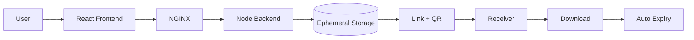
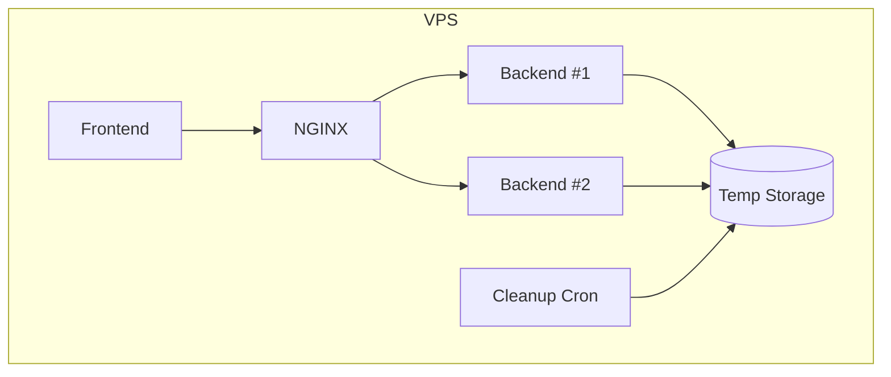
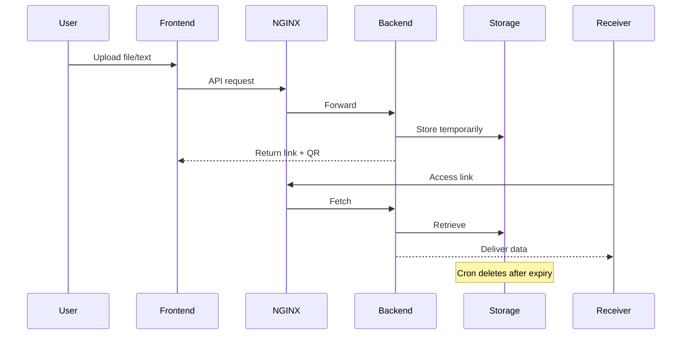

# 📤 ByteSend – Anonymous File & Text Sharing App

<p align="center">
  
</p>

<p align="center">
  
  
  
  
</p>

---

## ✨ What is ByteSend?

ByteSend is a **minimal, anonymous data transfer layer** built with Node.js and React.

No accounts. No persistence. No traces.


Think of it as a **self-destructing bridge for data**.

---

## 🚀 Core Features

* ⚡ **Stateless architecture** — no DB, no users
* ⏳ **Ephemeral storage** — auto cleanup via cron
* 🔗 **Short links + QR codes** for instant sharing
* 🐳 **Dockerized multi-container system**
* 🔁 **Horizontally scalable backend**
* 🌐 **NGINX reverse proxy** for routing
* 🔐 **Firewall secured (UFW)**
* 🚀 **CI/CD auto deployment ready**

---

## 🧩 System Architecture


```mermaid
flowchart LR
    U[User] --> FE[React Frontend]
    FE --> NX[NGINX]
    NX --> BE[Node Backend]
    BE --> ST[(Ephemeral Storage)]
    ST --> QR[Link + QR]
    QR --> R[Receiver]
    R --> DL[Download]
    DL --> EX[Auto Expiry]
```

---

## 🐳 Container Layout


```mermaid
flowchart TB
    subgraph VPS
        NGINX[NGINX]
        FRONTEND[Frontend]
        BACKEND1[Backend #1]
        BACKEND2[Backend #2]
        STORAGE[(Temp Storage)]
        CRON[Cleanup Cron]
    end

    FRONTEND --> NGINX
    NGINX --> BACKEND1
    NGINX --> BACKEND2
    BACKEND1 --> STORAGE
    BACKEND2 --> STORAGE
    CRON --> STORAGE
```

---

## 🔄 Request Lifecycle


```mermaid
sequenceDiagram
    participant U as User
    participant F as Frontend
    participant N as NGINX
    participant B as Backend
    participant S as Storage

    U->>F: Upload file/text
    F->>N: API request
    N->>B: Forward
    B->>S: Store temporarily
    B-->>F: Return link + QR
    Receiver->>N: Access link
    N->>B: Fetch
    B->>S: Retrieve
    B-->>Receiver: Deliver data
    Note over S: Cron deletes after expiry
```

---

## 📂 Features Breakdown

### 📁 File Transfer

* 📦 Max size: **99 MB**
* 🧼 Filename stripped for privacy
* ⏳ Temporary storage
* 📱 QR-based download

### 📝 Text Transfer

* 🔐 Anonymous text sharing
* 🎟 Short retrieval code
* ❌ No logs
* ⏳ Auto-delete

---

## 🛠 Tech Stack

| Layer      | Stack                    |
| ---------- | ------------------------ |
| Frontend   | React + Vite + Tailwind  |
| Backend    | Node.js + Express        |
| Infra      | Docker + NGINX           |
| Storage    | VPS ephemeral filesystem |
| Automation | Cron jobs                |
| Networking | Axios                    |
| Extras     | QR Code API              |

---

## 📂 Project Structure

```
filesharetextshare/
├── docker-compose.yml
├── backend/
├── frontend/
└── README.md
```

---

## ⚠ Limitations

* 📏 Max file size: **99 MB**
* ⏳ Files auto-deleted (no recovery)
* 🚫 Restricted file types
* 📄 `.pdf` intentionally blocked

---

## 🔐 Security Model

* 🕵️ No authentication
* 🧾 No persistent logs
* 🧹 Auto-expiry cleanup
* 🛡 Reverse proxy + firewall

---

## 🧠 Design Philosophy

ByteSend is built to be:

* ⚡ Fast
* 🧩 Stateless
* 🧼 Disposable

Not storage.

A **vanishing transport layer for data**.

---
